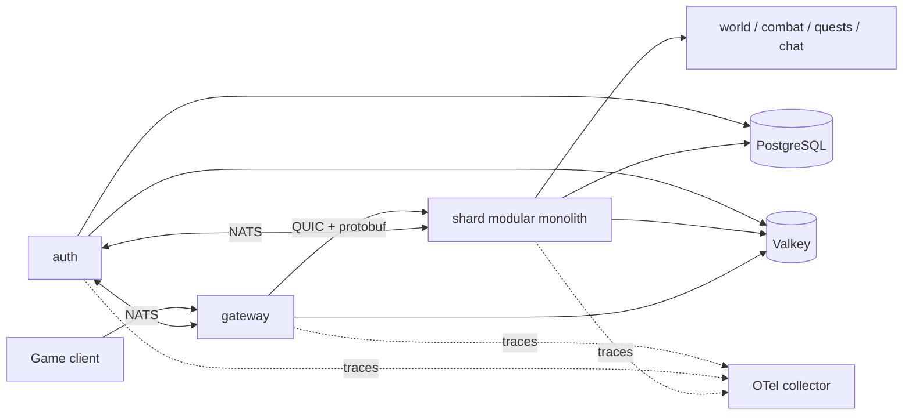

# SarnautCore server

This repository contains the Go services for SarnautCore. The shard currently hosts a fixed-rate zone, loads NPC placements from the private runtime data repository, and replicates authoritative movement over QUIC.

## Architecture



`shard` is a modular monolith. Its game systems stay under `internal` and communicate through Go interfaces. `auth` is a separate service, and `gateway` is the thin client edge. NATS connects processes. PostgreSQL and Valkey clients are wired but optional in this skeleton. QUIC sits behind `internal/transport`, so a later raw UDP implementation does not change the session protocol.

Wire definitions live in `proto/sarnaut/v1`. Generated Go code is committed under `gen/sarnaut/v1`.

## Development quickstart

Requirements:

- Go 1.26
- protoc 35 or later
- `protoc-gen-go` 1.36.12
- golangci-lint 2.12.2 for local linting

Generate, test, lint, and build on Windows:

```powershell
./scripts/generate.ps1
./scripts/test.ps1
./scripts/lint.ps1
./scripts/build.ps1
```

The equivalent Make targets are `make generate`, `make test`, `make lint`, and `make build`.

Run the services in separate PowerShell terminals. Start the shard first. It reads `classic/zones/inst-league1` from `E:\SarnautCore\data` by default:

```powershell
go run ./cmd/shard
go run ./cmd/auth
go run ./cmd/gateway
```

The gateway logs `shard handshake complete` after it receives the shard's `ServerHello`. Each process also exposes probes:

```powershell
Invoke-WebRequest http://127.0.0.1:8080/healthz # gateway
Invoke-WebRequest http://127.0.0.1:8081/readyz  # shard
Invoke-WebRequest http://127.0.0.1:8082/readyz  # auth
```

The shard creates an ephemeral self-signed certificate at startup. The gateway's development TLS configuration accepts it. This is local-only behavior.

Use the probe to enter the zone, send movement input, and print the number of snapshot packets and entity records received:

```powershell
go run ./cmd/probe -duration 5s
```

### Godot client integration smoke

With the `server` and `client` repositories in the same parent directory, run the cross-repository SAR-20 smoke:

```powershell
./scripts/sar20-client-smoke.ps1
```

The script builds and starts the real shard with an empty synthetic content fixture, runs the client's reusable .NET transport harness, and fails unless the joined player's position advances in an authoritative snapshot. It uses ports `4342` and `8181` by default so it does not disturb a shard on the development ports. Override `-ClientRepository`, `-Address`, or `-HealthAddress` when needed.

The Godot client uses `System.Net.Quic` over MsQuic. The public .NET 10 API has no QUIC datagram send or receive methods, so the connection does not negotiate datagrams and this server uses its ordered QUIC-stream fallback. Frames on that stream use the same 4-byte big-endian protobuf length prefix as `internal/transport`.

Copy `config.example.yaml`, set `SARNAUT_CONFIG` to its path, and override individual values with `SARNAUT_*` variables when needed. The main connection variables are:

| Variable | Purpose |
| --- | --- |
| `SARNAUT_SHARD_ADDRESS` | Gateway target, default `127.0.0.1:4242` |
| `SARNAUT_QUIC_LISTEN_ADDRESS` | Shard QUIC listener |
| `SARNAUT_HEALTH_ADDRESS` | Per-process health listener |
| `SARNAUT_CONTENT_ROOT` | Private runtime data root, default `E:\SarnautCore\data` |
| `SARNAUT_CONTENT_RULESET` | Content ruleset, default `classic` |
| `SARNAUT_CONTENT_ZONE_SLUG` | Content directory under `zones`, default `inst-league1` |
| `SARNAUT_WORLD_ZONE_ID` | Network zone ID, default `InstLeague1` |
| `SARNAUT_WORLD_TICK_INTERVAL` | Fixed simulation interval, default 30 Hz |
| `SARNAUT_WORLD_SNAPSHOT_INTERVAL` | Replication interval, default 15 Hz |
| `SARNAUT_NATS_URL` | NATS server URL |
| `SARNAUT_POSTGRES_DSN` | PostgreSQL connection string |
| `SARNAUT_VALKEY_ADDRESS` | Valkey host and port |
| `SARNAUT_OTEL_ENDPOINT` | OTLP gRPC collector host and port |

## About SarnautCore

This repository is part of SarnautCore, a fan-driven, non-commercial, open-source recreation kit for Allods Online.

The project charter and architecture decision records live in [SarnautCore/docs](https://github.com/SarnautCore/docs). Read those before opening a pull request here.

## Clean-room posture

SarnautCore is built clean-room. This project never distributes game assets or data owned by MY.GAMES. Anything you run through the kit comes from your own copy of the game, on your own machine.

## License

AGPL-3.0. See [LICENSE](LICENSE).
